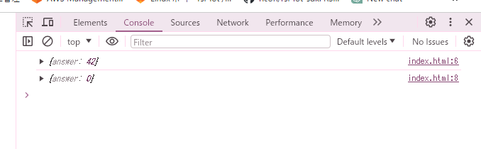
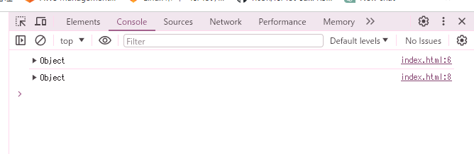

# 回答 1.4

## 予想

- 開発者ユールを開いた状態のタブ
  - コンソールに以下のように出力する
  ```
  42
  0
  ```
- HTML を開いた状態のタブで開発者ツールを開く場合
  - コンソールに出力されない

## 結果

- 開発者ユールを開いた状態のタブ
  - 42 と 0 が表示される
    
- HTML を開いた状態のタブで開発者ツールを開く場合
  - 0 と 0 が表示される
    

## 修正案

JSON.stringify()で文字列として出力する

```
<!DOCTYPE html>
<html>
  <body>
    <script>
      let life = { answer: 42 };
      console.log(JSON.stringify(life));
      life.answer = 0;
      console.log(JSON.stringify(life));
    </script>
  </body>
</html>
```
