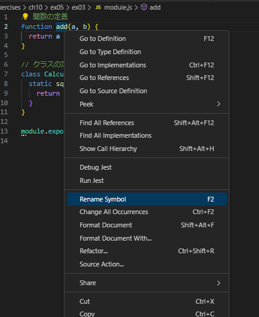

## 名前の変更

Visual Studio Code上で関数名、クラス名を右クリックし「Rename Symbol」をクリックして名前を変更した



## 変更結果

### Nodeモジュール方式(ex03)

変更前の名前を当ててexportする修正が自動で加えられた。
インポートしているファイルは変更は無かった

```
module.exports = { add: addNew, Calculator: CalculatorNew };
```

### ES6モジュール方式(ex04)

クラス名が変わるのみ。
自動で修正される場所は無かった。
インポート側は、defaultキーワードでインポートしているため、エラーは出なかった。
